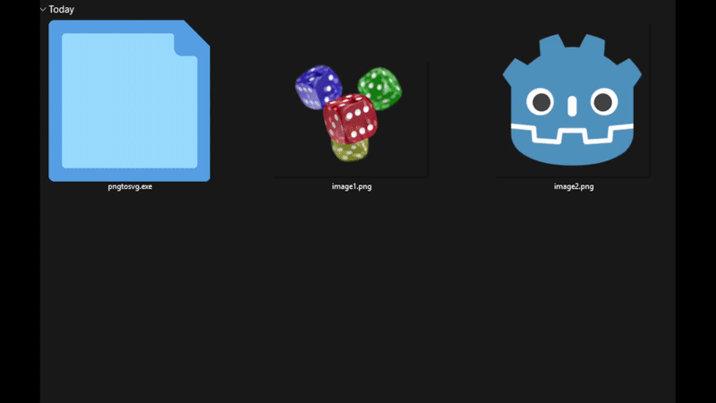

# PNGToSVG

[](https://crates.io/crates/pngtosvg)

A high-performance tool written in Rust that converts PNG raster images into SVG vectors.

*Note: This is a fast, standalone Rust rewrite of our original Python prototype. The old code is archived in [`/legacy_python`](./legacy_python).*

## Installation

**For Users:**
Download the standalone executable for your system from the [Releases](https://github.com/mayuso/PNGToSVG/releases) page. No dependencies required.

**For Developers:**
```bash
cargo install pngtosvg
```

## Usage

### Command Line (CLI)
```bash
pngtosvg image.png         # Convert a single file
pngtosvg ./assets/icons/   # Convert a specific folder
pngtosvg .                 # Convert the current directory
```
*(Note for Linux/macOS: If not in your `PATH`, prefix the executable with `./`)*

### Windows Desktop GUI
You don't need the terminal to use this tool on Windows:
* **Drag & Drop:** Drag your `.png` files directly onto the executable.
* **Double Click:** Double-click the executable to automatically convert all images in the same folder.

<p align="center">
  
  
</p>

## Use as a Rust Library

Add the dependency to your project:
```bash
cargo add pngtosvg
```

**Minimal Example:**
```rust
use pngtosvg::convert_file_to_svg;
use std::path::Path;

fn main() {
    let svg_content = convert_file_to_svg(Path::new("image.png")).unwrap();
    println!("{}", svg_content);
}
```

For advanced features, including in-memory `RgbaImage` conversions, please read the **[official documentation on docs.rs](https://docs.rs/pngtosvg)**.
```